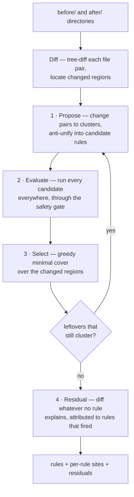
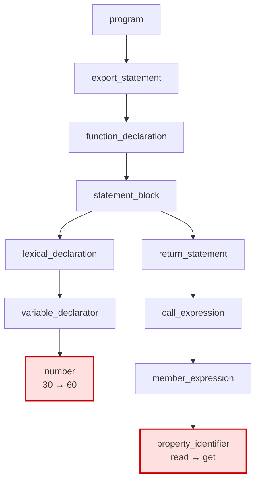
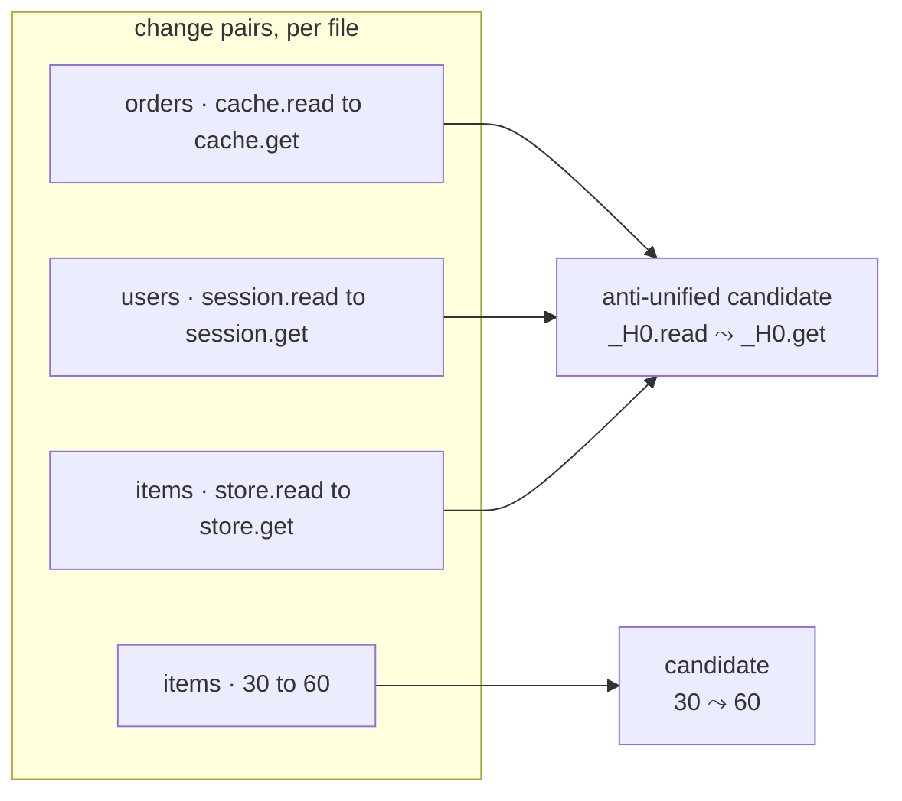
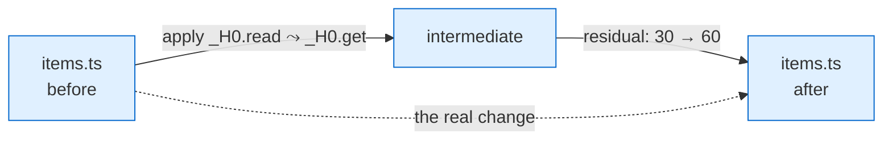
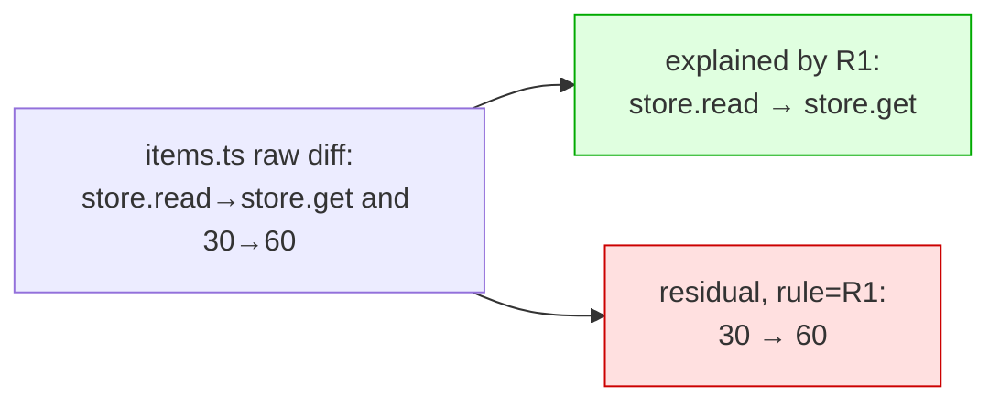
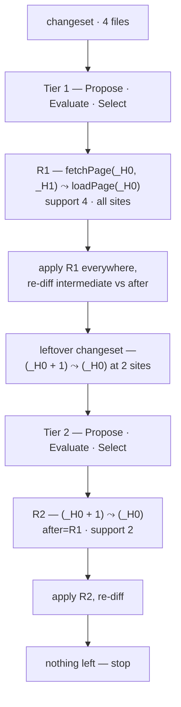

# Change Summary: A Walkthrough

This is an illustrated tour of what `diffract summarize` does, traced on two
small examples — a simple one, then one whose leftovers need a second tier. It
is deliberately simplified — for the full specification and the safety argument
see [`change-summary-design.md`](change-summary-design.md), and for CLI usage
see [`change-summary.md`](change-summary.md).

> The diagrams are [Mermaid](https://mermaid.js.org/); they render on GitHub
> and in most Markdown viewers.

## What it computes

Given a *before* and *after* snapshot of a codebase, `summarize` infers the
**semantic patch rules** that explain the systematic changes — the edits that
recur across many sites — and reports whatever no rule explains as **residual
diffs**, per file. The output is a factorization of the changeset:

> every file's change = (the rules that fire there) ∘ (its residual)

reproduced exactly, with every rule guaranteed *safe* (defined in
[Step 2](#step-2--evaluate)).

## The example

Three files. All three rename a method, `.read(…)` → `.get(…)` — but on a
*different* receiver each time: `cache`, `session`, and `store`. One of them,
`items.ts`, *also* bumps a constant — a one-off unrelated to the rename.

```ts
// before/orders.ts                  // after/orders.ts
export function loadOrder(id) {       export function loadOrder(id) {
  return cache.read(id);               return cache.get(id);
}                                     }

// before/users.ts                   // after/users.ts
export function loadUser(id) {        export function loadUser(id) {
  return session.read(id);             return session.get(id);
}                                     }

// before/items.ts                   // after/items.ts
export function loadItem(id) {        export function loadItem(id) {
  const ttl = 30;                      const ttl = 60;     // <- one-off
  return store.read(id);               return store.get(id);
}                                     }
```

We want `summarize` to discover *one* rule for the rename — abstracting the
receiver that varies across the three files — and to keep the `30 → 60` bump as
a residual (it happens once — not a pattern).

## The pipeline at a glance



The Propose → Evaluate → Select core runs in a loop (**tiering**): after
selecting rules, whatever change is left over is fed back in, so a rule can be
expressed "on top of" an earlier one (`after=R1`). The loop stops when a pass
explains nothing new.

## Step 0 · Diff

Each file is parsed with tree-sitter and the before/after trees are compared
(GumTree-style). The output is a set of **changed regions** and, within them,
**change pairs**: a before-subtree paired with its after-counterpart, emitted
at *every* level of the change — the replaced leaf, and each modified ancestor
up the chain.

Here is `items.ts`. Two leaves actually changed; everything else is structure
the diff threads through:



From the `read → get` leaf, the diff emits change pairs at several levels —
`read ⤳ get`, then `store.read ⤳ store.get`, then `store.read(id) ⤳
store.get(id)`, and so on. Emitting at every level lets the next step choose
the right granularity instead of guessing it. (Within `items.ts` the receiver
`store` is unchanged — but it differs across the three files, and that is the
part Step 1 abstracts.) The `30 → 60` leaf emits its own pairs independently.
`orders.ts` and `users.ts` are the same single chain — with receivers `cache`
and `session` — minus the `lexical_declaration` branch.

## Step 1 · Propose

Change pairs with the same shape are grouped and **anti-unified**: parts that
agree across the group stay concrete, parts that differ become holes (`_H0`,
`_H1`, …). The three member-expression pairs — `cache.read ⤳ cache.get`,
`session.read ⤳ session.get`, `store.read ⤳ store.get` — agree on everything
except the receiver, so anti-unifying them keeps `.read → .get` concrete and
abstracts the receiver into a hole: **`_H0.read ⤳ _H0.get`**. The leaf-only
`read ⤳ get` and the wider `_H0.read(id) ⤳ …` are also proposed as
alternatives. The `30 → 60` pair stands alone — nothing to anti-unify it with.



Proposal is generous: the leaf-only `read ⤳ get`, the anti-unified
`_H0.read ⤳ _H0.get`, and broader forms are *all* candidates. (Several
extra candidate shapes — general "delta-keyed" and per-site "anchored"
variants — are also proposed here; see design §3.2. They do not change this
example.) Proposing is cheap and never decides anything: the next two steps do.

## Step 2 · Evaluate

This is the heart. Every candidate is *run* against every file and put through
the **safety gate**. A candidate is **safe** at a site when applying it lands
exactly on the path from before to after — it makes real progress toward the
after state and never has to be undone:



Formally the rule must lie on the *geodesic*: `dist(before, t'') + dist(t'',
after) = dist(before, after)` — no detour, no overshoot. The gate also checks
that the rule's edits land inside genuinely-changed regions (not unrelated
code) and that the result still parses. A candidate that breaks this at a site
is *shed* from that site rather than mis-stating the change there.

Running our candidates:

| candidate | fires at | safe? | support |
|---|---|---|---|
| `_H0.read ⤳ _H0.get` | orders, users, items | yes, all three | **3** |
| `read ⤳ get` (leaf only) | — | re-parses as a bare identifier, finds nothing | 0 |
| `30 ⤳ 60` | items | yes | 1 |

The leaf-only `read ⤳ get` illustrates why evaluation matters: rendered in
isolation, `read` parses as an ordinary identifier, not the `property_identifier`
it was in context, so it matches nothing and drops out. `30 ⤳ 60` is safe but
fires only once.

## Step 3 · Select

From the safe candidates, `summarize` picks a **minimal set that covers the
changed regions**, greedily, preferring higher coverage and tighter patterns.
A candidate must clear `min_support` (default 2) to be selected.

- `_H0.read ⤳ _H0.get` covers three regions → **selected as R1**.
- `30 ⤳ 60` has support 1 < 2 → **not selected**; its region stays uncovered.

## Step 4 · Tier, then Residual

The leftovers (here just the `30 → 60` region in `items.ts`) are fed back into
Propose. Nothing new clusters — it is a lone change — so the tier loop ends.

Each file's remaining change, after applying the selected rules, is emitted as
a **residual diff**, attributed to the rules that fired there. Applying R1 to
`items.ts` turns `store.read` into `store.get` (with `_H0` bound to `store`);
re-diffing against the real after leaves exactly the `30 → 60` bump:



## The result

```
# rule R1  support=3  language=typescript
@@
match: strict
metavar _H0: single
@@
- _H0.read
+ _H0.get
# sites R1
items.ts
orders.ts
users.ts

# residual  rule=R1
--- a/items.ts
+++ b/items.ts
@@ ... @@
-  const ttl = 30;
+  const ttl = 60;
```

Read it as: *R1 is the systematic change (3 sites); the only thing R1 doesn't
explain is one constant bump in `items.ts`, which happens after R1 has fired
there.*

## A bigger example: when leftovers cluster

In the first example the leftover (`30 → 60`) was a lone one-off, so it became a
residual. But sometimes the leftovers *themselves* form a pattern across files —
and that is what the tier loop (the `yes` branch in the pipeline diagram) is for.

Here is a four-file pagination migration. Every call is renamed `fetchPage →
loadPage` and loses its now-defaulted page-size argument; and the sites that used
1-based pages *also* switch to 0-based indexing by dropping the `+ 1`.

```ts
// before                                       // after
const rows = fetchPage(offset + 1, pageSize);   const rows = loadPage(offset);   // orders.ts
const rows = fetchPage(start, 20);              const rows = loadPage(start);    // users.ts
const rows = fetchPage(cursor, limit);          const rows = loadPage(cursor);   // items.ts
const rows = fetchPage(page + 1, size);         const rows = loadPage(page);     // carts.ts
```

**Tier 1** finds the change present at *every* site — the rename-and-drop — and
selects:

> `R1 — fetchPage(_H0, _H1) ⤳ loadPage(_H0)` (support 4)

Why isn't the `+ 1` removal caught here too? At `orders.ts` the raw
before→after is `fetchPage(offset + 1, pageSize)` → `loadPage(offset)`: the call
changed shape *and* its first argument lost the `+ 1` in one step, so there is
no clean, isolated `offset + 1 → offset` pair to cluster yet. It only surfaces
once R1 has normalized the surrounding call. So `summarize` **applies R1
everywhere and re-diffs** the result against the real after:

```
after applying R1, compared to the real "after":
  orders.ts   loadPage(offset + 1)   still differs  →  (offset + 1) → (offset)
  users.ts    loadPage(start)        matches        →  nothing left
  items.ts    loadPage(cursor)       matches        →  nothing left
  carts.ts    loadPage(page + 1)     still differs  →  (page + 1) → (page)
```

Now the remaining change is uniform across two sites. Fed back into Propose it
clusters — and because it is expressed in code that R1 produced, it is recorded
as running *on top of* R1:

> `R2 — (_H0 + 1) ⤳ (_H0)` (support 2, `after=R1`)

A third pass finds nothing left, so the loop stops.



The result:

```
# rule R1  support=4  language=typescript
@@
match: strict
metavar _H0: single
metavar _H1: single
@@
- fetchPage(_H0, _H1)
+ loadPage(_H0)
# sites R1
carts.ts
items.ts
orders.ts
users.ts

# rule R2  support=2  language=typescript  after=R1
@@
match: strict
metavar _H0: single
@@
- (_H0 + 1)
+ (_H0)
# sites R2
carts.ts
orders.ts
```

Every site got the rename-and-drop (R1); the two 1-based sites *additionally*
got the 0-based fix (R2). The `after=R1` annotation records the ordering — R2's
pattern only matches code R1 has already produced — so the rules must be applied
R1-then-R2.

| site | change | R1 | R2 |
|---|---|:--:|:--:|
| `orders.ts` | `fetchPage(offset + 1, pageSize)` → `loadPage(offset)` | yes | yes |
| `users.ts` | `fetchPage(start, 20)` → `loadPage(start)` | yes | — |
| `items.ts` | `fetchPage(cursor, limit)` → `loadPage(cursor)` | yes | — |
| `carts.ts` | `fetchPage(page + 1, size)` → `loadPage(page)` | yes | yes |

## The guarantee

The pair (rules, residuals) **reproduces the changeset exactly** — apply the
rules in their `after=` order, then the residual, and you get the real
after-source for every file. And every rule is **safe at every site it claims**: it never mis-states
a change, because the evaluation gate admitted it only where it lands on the
geodesic. That is the property the whole pipeline is built to preserve; the
clustering and selection only decide *how compactly* the change is stated,
never *whether it is stated correctly*.
